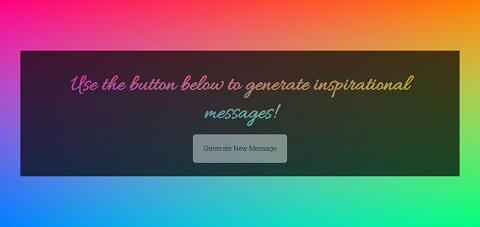

# Mixed Messages

Mixed Messages is one of Codecademy's open-ended projects, in which it is encouraged to problem solve and utilize other resources, instead of being provided with step-by-step guidance. The requirements were to build a message generator program using JavaScript, where each time the program is run it generates a new, randomized output. To make the program truly random, the output message needed to be made up of at least three different pieces of data. We were instructed to come up with a topic, decide on what types of messages we would want the program to output, decide how to store the message components and then add functionality to randomly select the different message components to create a cohesive message that is displayed to the user.

## Table of Contents

- [Technologies](#technologies)
- [Screenshots](#screenshots)
- [Status](#status)

## Technologies

This project was created with:

- JavaScript ES6
- HTML5
- CSS3

## Screenshots

## Status

This project has been completed.